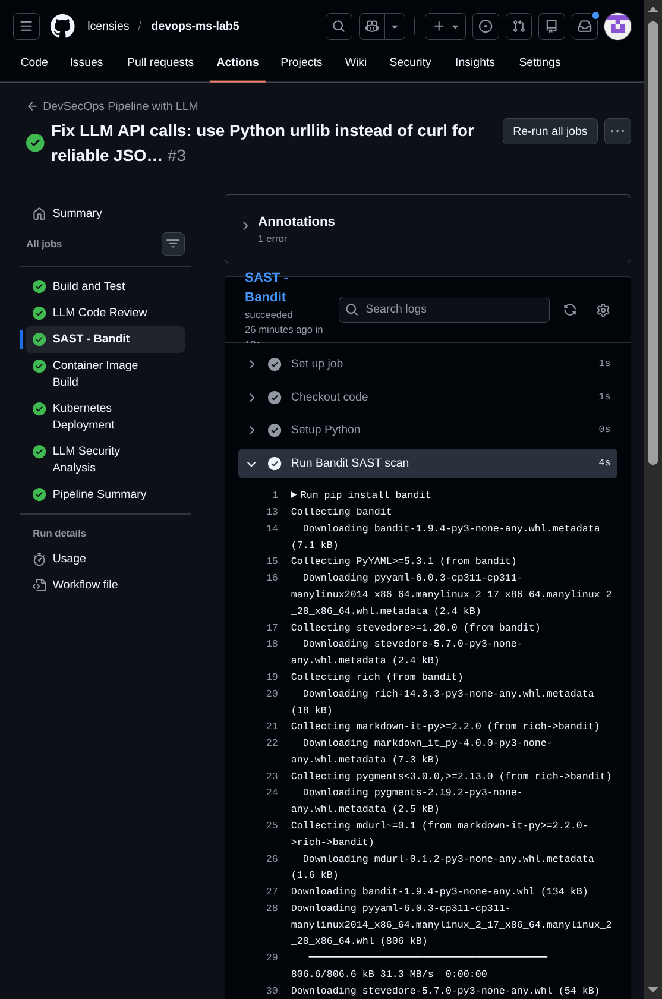
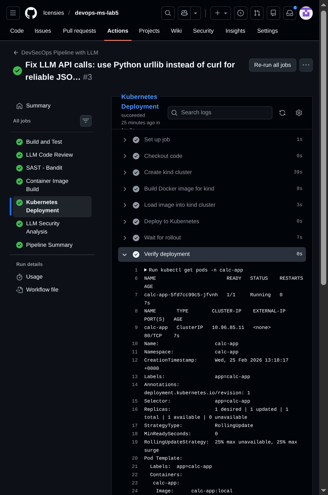
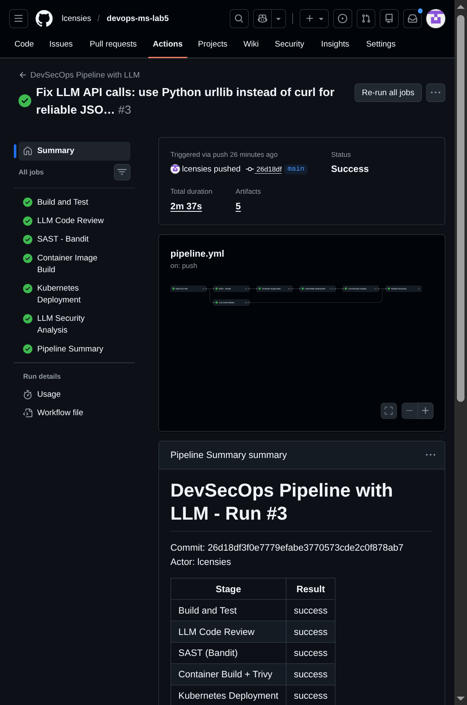
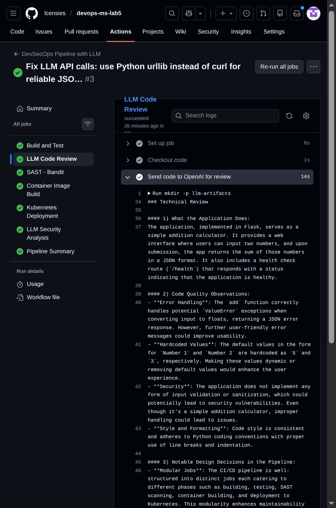
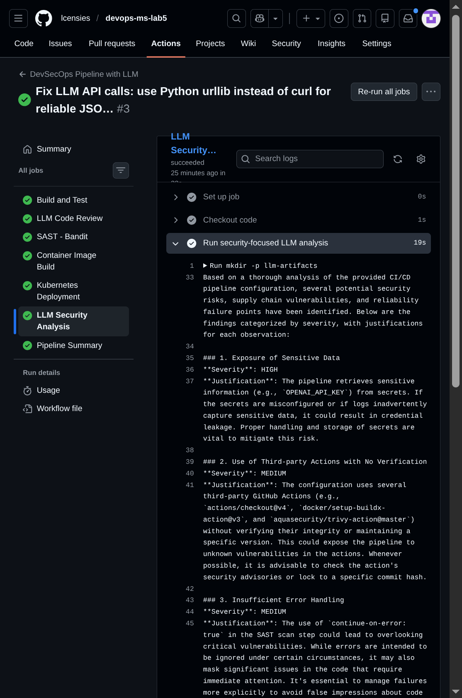

# Lab 5: Using Large Language Models (LLMs) in DevOps Pipelines

Repository: https://github.com/lcensies/devops-ms-lab5

The lab extends the Lab 3 CI/CD pipeline with a SAST stage, Kubernetes deployment, and two LLM-assisted review stages using the OpenAI API.

## Task 1: CI/CD Pipeline Baseline with Security and Kubernetes

### 1.1 Pipeline from Lab 3

The Lab 3 pipeline ran on a self-managed GitLab instance and covered: source checkout, build (pip install), test (pytest), Docker image build and push, and Ansible-based deployment. It used branch-specific rules (`main` for production, `develop` for staging) with manual deployment gates.

For lab 5 the application and pipeline were migrated to GitHub Actions in a dedicated repository.

### 1.2 SAST Stage

Added a Bandit static analysis stage. Bandit scans `app.py` and writes results to `bandit-report.json`, which is uploaded as a pipeline artifact.

```yaml
sast-scan:
  name: SAST - Bandit
  runs-on: ubuntu-latest
  needs: build-and-test
  steps:
    - uses: actions/checkout@v4
    - uses: actions/setup-python@v5
      with: { python-version: '3.11' }
    - name: Run Bandit SAST scan
      continue-on-error: true
      run: |
        pip install bandit
        bandit -r app.py -f json -o bandit-report.json || true
        bandit -r app.py
    - uses: actions/upload-artifact@v4
      with: { name: bandit-sast-report, path: bandit-report.json }
```



Bandit output (run #3):

```
Test results:
>> Issue: [B104:hardcoded_bind_all_interfaces] Possible binding to all interfaces.
   Severity: Medium   Confidence: Medium
   CWE: CWE-605
   Location: ./app.py:36  app.run(host='0.0.0.0', port=80)

Run metrics:
  Total lines of code: 31
  Medium: 1 issue
  High: 0 issues
```

The finding is expected — `host='0.0.0.0'` is intentional for a containerised app. `continue-on-error: true` keeps the pipeline green while preserving the finding in the artifact.

### 1.3 Kubernetes Deployment Stage

Added `k8s-deploy` job after container build. It creates a `kind` (Kubernetes in Docker) cluster on the GitHub Actions runner, builds the image locally, loads it into the cluster, and applies the manifests from `k8s/`.

```yaml
k8s-deploy:
  name: Kubernetes Deployment
  runs-on: ubuntu-latest
  needs: container-build
  steps:
    - uses: actions/checkout@v4
    - uses: helm/kind-action@v1
      with: { cluster_name: calc-cluster }
    - run: docker build -t calc-app:local .
    - run: kind load docker-image calc-app:local --name calc-cluster
    - run: |
        kubectl apply -f k8s/namespace.yaml
        kubectl apply -f k8s/deployment.yaml
    - run: kubectl rollout status deployment/calc-app -n calc-app --timeout=120s
```

Manifests (`k8s/namespace.yaml`, `k8s/deployment.yaml`) define a `calc-app` namespace, a 1-replica Deployment with readiness/liveness probes on `/health`, and a ClusterIP Service on port 80.



Deployment verification output from the pipeline logs:

```
NAME                        READY   STATUS    RESTARTS   AGE
calc-app-5fd7cc99c5-jfvnh   1/1     Running   0          7s

NAME       TYPE        CLUSTER-IP    EXTERNAL-IP   PORT(S)   AGE
calc-app   ClusterIP   10.96.85.11   <none>        80/TCP    7s

Replicas: 1 desired | 1 updated | 1 total | 1 available | 0 unavailable
```

## Task 2: LLM Setup and Deployment

### 2.1 API Key Setup

Used the OpenAI API (`gpt-4o-mini`). The key was obtained from https://platform.openai.com, stored as a GitHub Actions repository secret (`OPENAI_API_KEY`), and tested locally:

```bash
curl -s https://api.openai.com/v1/chat/completions \
  -H "Authorization: Bearer $OPENAI_API_KEY" \
  -H "Content-Type: application/json" \
  -d '{"model":"gpt-4o-mini","messages":[{"role":"user","content":"Hello"}],"max_tokens":20}'
```

### 2.2 `llm-review` Stage

The `llm-review` job runs after `build-and-test`. It reads `app.py` and `pipeline.yml`, constructs a JSON payload in Python (to avoid shell escaping issues), calls the OpenAI API, and saves the response as `llm-review.md`.

```yaml
llm-review:
  name: LLM Code Review
  runs-on: ubuntu-latest
  needs: build-and-test
  steps:
    - uses: actions/checkout@v4
    - name: Send code to OpenAI for review
      env:
        OPENAI_API_KEY: ${{ secrets.OPENAI_API_KEY }}
      run: |
        mkdir -p llm-artifacts
        python3 - <<'PYEOF'
        import os, json, urllib.request
        app_code = open('app.py').read()
        pipeline = open('.github/workflows/pipeline.yml').read()
        user_content = f"Review this application source code and CI/CD pipeline:\n\n### app.py\n{app_code}\n\n### pipeline.yml\n{pipeline}"
        payload = json.dumps({
            "model": "gpt-4o-mini",
            "messages": [
                {"role": "system", "content": "You are a senior software engineer..."},
                {"role": "user", "content": user_content}
            ],
            "max_tokens": 800
        }).encode()
        req = urllib.request.Request(
            "https://api.openai.com/v1/chat/completions",
            data=payload,
            headers={"Content-Type": "application/json",
                     "Authorization": f"Bearer {os.environ['OPENAI_API_KEY']}"}
        )
        with urllib.request.urlopen(req) as resp:
            data = json.loads(resp.read())
        result = data["choices"][0]["message"]["content"]
        open("llm-artifacts/llm-review.md", "w").write(result)
        print(result)
        PYEOF
    - uses: actions/upload-artifact@v4
      with: { name: llm-review, path: llm-artifacts/llm-review.md }
```

### 2.3 Why LLM After Build and Test

The LLM stage is placed after build and test because:

- It should only review code that compiles and passes tests. Sending broken code wastes API tokens and produces irrelevant output.
- Build and test failures are hard blockers that should be fixed before any secondary analysis runs.
- The LLM review is informational (non-blocking) — it annotates working code, not failed builds.
- It runs in parallel with `sast-scan` (both depend on `build-and-test`), so it adds no extra wall-clock time.

## Task 3: Testing and Validation

### 3.1 Pipeline Run

Run #3 (`26d18df`) — all 7 stages passed in 2m 37s:



```
gh run view 22398526632 --repo lcensies/devops-ms-lab5

✓ main DevSecOps Pipeline with LLM · 22398526632

JOBS
✓ Build and Test           8s
✓ LLM Code Review         18s
✓ SAST - Bandit           10s
✓ Container Image Build   33s
✓ Kubernetes Deployment   1m 2s
✓ LLM Security Analysis   22s
✓ Pipeline Summary         4s

ARTIFACTS
  bandit-sast-report
  llm-review
  trivy-container-scan
  k8s-deployment-report
  llm-security-analysis
```

Pipeline URL: https://github.com/lcensies/devops-ms-lab5/actions/runs/22398526632

### 3.2 LLM Review Output



The `llm-review` artifact contains:

```
### Technical Review

#### 1) What the Application Does:
The application, implemented in Flask, serves as a simple addition calculator.
It provides a web interface where users can input two numbers, and the app
returns the sum in JSON format. It also includes a health check route (/health).

#### 2) Code Quality Observations:
- Error handling in the add() function correctly catches ValueError.
- The application does not implement input validation or sanitization beyond
  type conversion, which could lead to issues with unexpected input.
- Code style is consistent and adheres to Python conventions.

#### 3) Notable Design Decisions in the Pipeline:
- Modular jobs covering build, SAST, container scanning, K8s deployment,
  and LLM review enhance maintainability.
- Integration of LLM-based review is a notable innovation that adds analysis
  not achievable with standard static tools.
- Each job uploads artifacts for traceability.

#### 4) Potential Improvement Areas:
- Input validation should be more thorough.
- The app runs on port 80 without HTTPS — SSL/TLS would improve security.
- Multi-stage Docker build would reduce image size.
- More extensive integration tests beyond unit tests.
```

### 3.3 LLM Output Assessment

The output correctly identifies the application as a Flask calculator and accurately describes the pipeline structure. The observations about missing input sanitization and the lack of HTTPS are valid. The suggestion about multi-stage Docker builds is useful but low priority for a demo app. The comment about environment variable management (keeping `OPENAI_API_KEY` in secrets) is correct — the pipeline already does this via GitHub Secrets.

## Task 4: Security and Trust Analysis

### 4.1 Security Risks of Sending Code to an LLM

Sending source code, logs, or CI/CD configurations to an external LLM introduces several risks:

**Data exfiltration**: The code leaves the organisation's perimeter. If `app.py` contained business logic, credentials, or proprietary algorithms, those would be sent to a third-party API. Even seemingly innocuous code can reveal architecture and dependencies.

**Secret leakage**: Pipeline configurations often contain variable names, endpoint URLs, and partial secret references. A misconfigured pipeline could accidentally interpolate a secret value into the prompt.

**Supply-chain trust**: The LLM provider controls the model and the inference infrastructure. There is no guarantee the model was not trained on similar code, that inputs are not logged for retraining, or that the API itself has not been compromised.

**Prompt injection**: If the code being reviewed contains attacker-controlled strings (e.g., from a dependency or user-submitted file), those strings could influence the LLM's output — potentially suppressing real findings.

**False confidence**: The LLM may miss real vulnerabilities or hallucinate non-existent ones. Treating LLM output as authoritative without human review is a trust risk.

### 4.2 Security-Focused Prompt and Analysis



The `llm-security-review` stage runs after `k8s-deploy` and uses a prompt that explicitly instructs the model to analyse the pipeline from a security, reliability, and trust perspective with severity ratings.

Prompt used:

```
System: You are a DevSecOps security engineer. Analyze the provided CI/CD pipeline
configuration from a security, reliability, and trust perspective. Identify potential
security risks, vulnerabilities, and failure points. For each finding, rate its
severity (HIGH/MEDIUM/LOW) and justify your observation. Be specific and critical.

User: Analyze this CI/CD pipeline for security risks, supply-chain vulnerabilities,
and reliability failure points: [pipeline.yml contents]
```

LLM security analysis output (`llm-security-analysis` artifact):

```
1. Exposure of Sensitive Data [HIGH]
   OPENAI_API_KEY retrieved from secrets. If logs capture it or secrets are
   misconfigured, credential leakage occurs.

2. Third-party Actions Without Version Pinning [MEDIUM]
   actions/checkout@v4, docker/setup-buildx-action@v3, trivy-action@master
   are used without commit-hash pinning, exposing the pipeline to supply-chain
   attacks if action maintainers push malicious updates.

3. continue-on-error on SAST [MEDIUM]
   Masking SAST failures could give a false impression of code quality if a
   high-severity finding is later added. Should only suppress known-acceptable
   findings, not all failures.

4. LLM Review Reliability [MEDIUM]
   The OpenAI model may not know the latest CVEs. Dependency on an external
   API for security review creates a false sense of coverage.

5. Docker Base Image Vulnerabilities [HIGH]
   python:3.11-slim is scanned by Trivy but any new CVEs published after the
   scan run are not caught until the next pipeline execution.

6. No RBAC in Kubernetes Deployment [HIGH]
   The deployment does not define ServiceAccount, Role, or RoleBinding.
   The pod runs with default permissions which may be overly broad.

7. Artifact Retention of Sensitive Reports [LOW]
   30-day retention for Bandit and Trivy reports means security findings remain
   accessible to anyone with repository access for that period.

8. No Dependency Audit [MEDIUM]
   pip install -r requirements.txt without a lock file or pip-audit allows
   transitive dependency version drift introducing unvetted packages.
```

**Assessment of findings:**

Valid and important:
- Third-party action pinning (finding 2) is a real supply-chain risk. The pipeline should pin actions to commit hashes.
- No RBAC in K8s (finding 6) is correct — the deployment does not define RBAC resources.
- Dependency audit (finding 8) is valid — `requirements.txt` lacks a lock file.

Valid but overstated:
- The OpenAI key exposure risk (finding 1) is real in general but mitigated here since the key is in GitHub Secrets and never printed in logs.
- `continue-on-error` on SAST (finding 3) is a legitimate concern, though acceptable for a MEDIUM finding.

Questionable:
- Finding 4 (LLM reliability) is accurate as a general principle but somewhat circular — the LLM is reviewing its own limitations.
- Finding 5 is correct but applies to all pipelines that use base images; Trivy is already running to address this.
